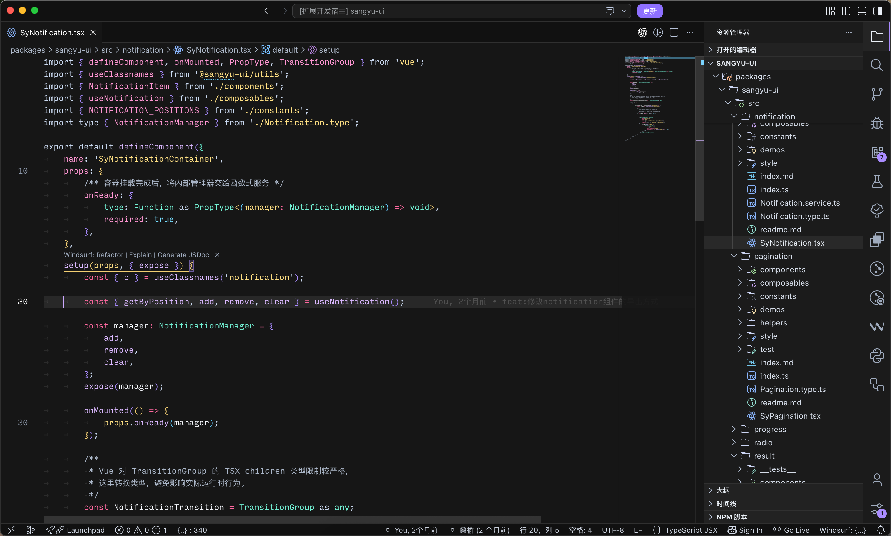
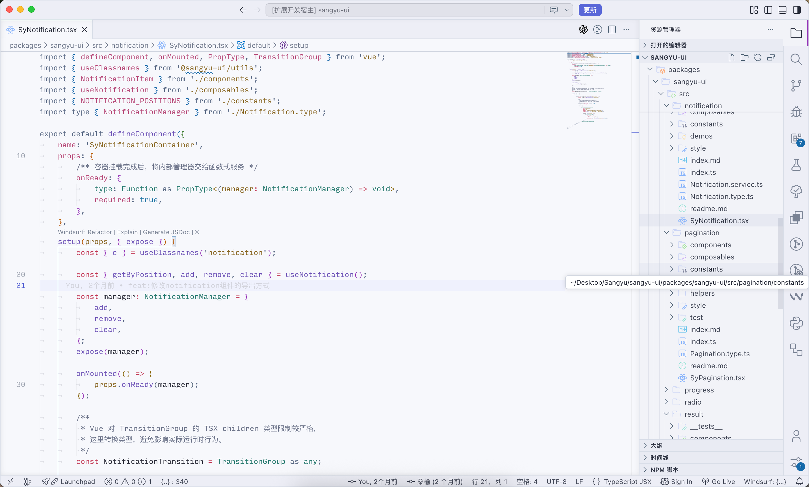

# Lumen Drift

A vivid, carefully balanced VS Code theme family with dark and light variants.

Lumen Drift uses luminous syntax colors, restrained interface contrast, and a subtle active-line highlight to make code easy to scan without turning the whole editor into a wall of color.

Lumen Drift 是一套同时支持深色与浅色模式的 VS Code 主题。它使用鲜明但有层次的语法配色，并让编辑器、侧边栏、面板和弹窗保持统一。

## Theme variants / 主题模式

### Lumen Drift Dark

- Near-black editor background: `#161616`
- Bright syntax accents designed for strong contrast
- Neutral active-line highlight without a blue color cast
- Coordinated title bar, activity bar, side bar, panel, terminal, and widgets



### Lumen Drift Light

- Soft near-white editor background: `#F7F8FC`
- Darker syntax accents for comfortable daytime use
- Matching light workbench colors with clear borders and selection states
- The same syntax roles as the dark variant for a consistent experience



## Highlights / 特色

- Dark and light themes in one extension
- Semantic highlighting and TextMate scope support
- Complete workbench styling, including tabs, lists, inputs, notifications, Git decorations, diffs, terminal colors, and minimap markers
- Clear comments and readable secondary text
- Distinct colors for keywords, functions, strings, numbers, types, properties, and operators
- Subtle glow-like contrast using standard VS Code theme capabilities

## Syntax palette / 语法配色

| Syntax role | Dark | Light |
| --- | --- | --- |
| Keywords | `#FF68A0` | `#C43E5A` |
| Functions | `#DAB8FF` | `#7157B8` |
| Strings | `#FFE083` | `#8A6824` |
| Numbers | `#76DDFF` | `#2377A6` |
| Types | `#72F2D5` | `#277A70` |
| Properties / namespaces | `#FF96D2` | `#B74978` |
| Operators | `#CAD9F0` | `#596984` |
| Comments | `#ABB7C8` | `#697187` |

## Installation / 安装

### From the VS Code Marketplace

After the extension is published:

1. Open the Extensions view in VS Code.
2. Search for `Lumen Drift`.
3. Select **Install**.

### Install a local VSIX

Package the extension from this repository:

```bash
npx @vscode/vsce package
```

Then open the Command Palette and run **Extensions: Install from VSIX...**.

## Choose a theme / 切换主题

1. Open the Command Palette with `Ctrl+Shift+P` or `Cmd+Shift+P`.
2. Run **Preferences: Color Theme**.
3. Choose **Lumen Drift Dark** or **Lumen Drift Light**.

You can also open the theme picker with `Ctrl+K Ctrl+T` on Windows/Linux or `Cmd+K Cmd+T` on macOS.

## Development / 本地调试

1. Open this repository in VS Code.
2. Press `F5` to start an Extension Development Host window.
3. In that window, open **Preferences: Color Theme** and select a Lumen Drift theme.
4. After editing a theme file, run **Developer: Reload Window** in the development window.

To inspect how a token is being colored, run **Developer: Inspect Editor Tokens and Scopes** and click the token in the editor.

## Customization / 自定义

VS Code settings can override any theme color. For example:

```json
{
  "workbench.colorCustomizations": {
    "[Lumen Drift Dark]": {
      "editor.lineHighlightBackground": "#FFFFFF18"
    }
  },
  "editor.tokenColorCustomizations": {
    "[Lumen Drift Dark]": {
      "comments": "#B7C2D2"
    }
  }
}
```

If the theme does not look as expected, check whether global `workbench.colorCustomizations`, `editor.tokenColorCustomizations`, or `editor.semanticTokenColorCustomizations` settings are overriding it.

## About the glow effect / 关于发光效果

Standard VS Code color themes cannot apply CSS effects such as `text-shadow`. Lumen Drift creates a glow-like appearance through bright syntax colors, controlled contrast, and a subtle active-line highlight, while remaining compatible with normal VS Code theme installation and Marketplace publishing.

## Feedback

When reporting a color issue, include the programming language, a screenshot, and the output of **Developer: Inspect Editor Tokens and Scopes** for the affected token. This makes scope-specific fixes much easier.
